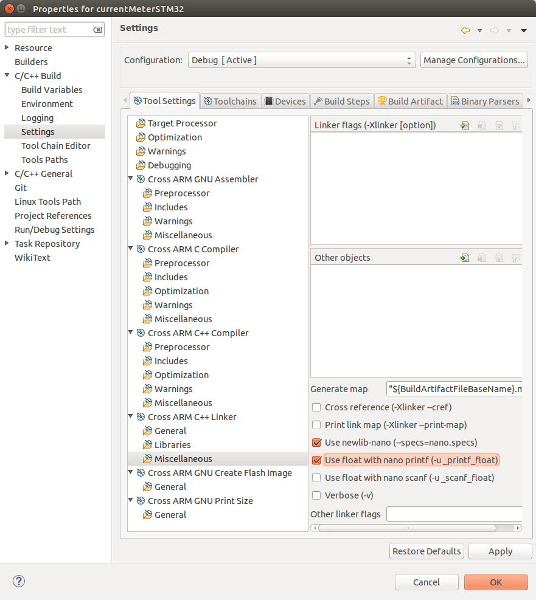

# Current Meter in STM32F103C8T in form known as blue pill
 
This project are created as a current meter in ZXCT1009   
activate 2 ADC to read current and voltage. then, calculate the discharge or recharge transistor duty cycle.
perhaps we need to see MOSFET and trying timer as PWM.
we activate the UART and ADC  
remove timer stdperiph source file from disabled filter.  

- [x] Enable the UART  
- [x] Enable the ADC free running  
- [x] Trying single conversion
- [ ] When using DMA don't forget to make a circular buffer and check if the circular buffer ever overflow
- [ ] tidying the ADC free running code 
- [ ] Enable the Timer to trigger the ADC  
- [ ] do ADC scan conversion mode  
- [ ] update the platform_config.h  
- [x] configure PWM at Timer3 channel1  

  
  ## About github
  create a new issue and track it

Note:
Since we use newlib-nano please becarefull when using printf to print from float data type, it takes so much computation power and storage.  
  
  
PC software:  
write to *.txt file  

